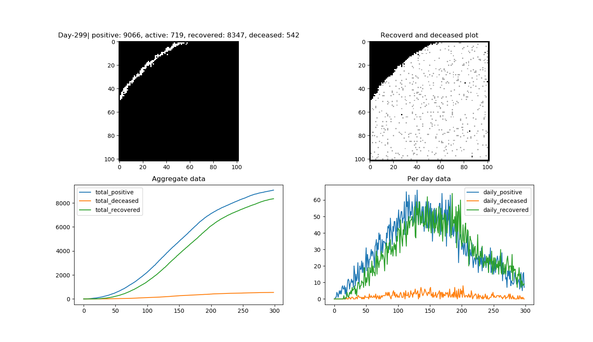

# Covid-19 toy simulation

To energize myself in this difficult time what could a better way than to use your limited skill to simulate the global crisis in your own laptop. Here is that - 

To run the simulation type  below command. 
```
python3 simulation.py <grid_length> <days_to_observe> <random_seed_value>
```
Example 
```
python3 simulation.py 40 60 100

```



